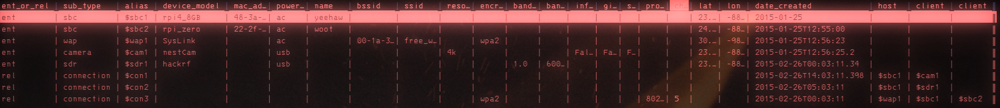

# csv_to_tql_insert_script

Automatically generates a TypeQL script for doing entity and relationship insertions from a .csv file, so you don't have to mess with writing TypeQL. 

## CSV FORMAT

Each row represents either an entity or a relationship.

<b> 3 columns are mandatory </b>, the rest can be whatever you want.

- `ent_or_rel` - the script uses this so figure out if it's supposed to be making an entity or a relationship for this row of data. You can write `ent` or `entity` or `rel` or `rel`. Capitalization doesn't matter- just the letters `ent` and `rel`. You can even write `entropy` and it'll recognize the `ent` as meaning this is an entity row.

- `sub_type` - defines <i>what kind of entity or relationship is it</i> supposed to be. For example, if you have a `person` entity in your schema, and this row is for a person, then you put `person` there.

- `alias` - this is the typeQL-style variable you will use to represent this entity. e.g. `$x`. Each row must a unique one.

### Other Column Names

The rest of the column names must correspond to your schema's `attributes` and `roles`.

The values in your role columns (<i> in my example `host` and `client`</i>) must correspond to the aliases you used when defining your entities.

<u>Column order is not important</u>. The script will figure out which columns are attributes, and which ones are roles in a relationship (the `plays` part).

Row order `is` important, but no more than it is in any TypeQL script. Just make sure you define your entities before you start making links between them.

## HOW TO USE

0. Install the Python package `pandas`
   - `conda install pandas -y`
     or
   - `pip3 install pandas`
1. <u>Have your database & schema created already</u>. This only adds entities and relations to a pre-existing database with a schema loaded.
2. Save this script somewhere on your computer. It has been tested with Python3.6, but it should work with any Python3.x.
3. $ `python3 path/to/data.csv path/to/desired_script_name.tql`
4. Launch your TypeDB console (method varies depending on your install)
5. `> transaction <database_name> data write`
6. `> source /path/to/desired_script_name.tql`
7. `> commit`

Voila, your data is now in your database.
